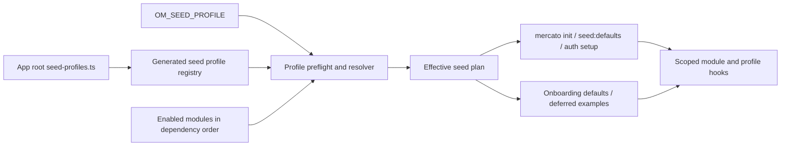

# Environment-Specific Centralized Seed Profiles

## TLDR

Open Mercato will add an app-level `seed-profiles.ts` registry selected explicitly through `OM_SEED_PROFILE`. Deployment operators will be able to keep development, staging, production, and other seed behavior in one central file, while module authors continue to own environment-agnostic `seedDefaults` and `seedExamples` hooks.

For each enabled module and seed phase, a selected profile may inherit the module hook, skip it, replace it, or run an app-owned hook after it. The same resolver will govern installation, explicit reseeding, standalone auth setup, and onboarding so one deployment cannot seed tenants differently depending on the entry point. Existing applications remain unchanged when no profile is selected.

**Scope:** typed profile contract and loader, explicit deployment selection, deterministic precedence, preflight validation, shared resolution across every setup path, standalone-template parity, tests, and operator documentation.

**Boundaries:** no runtime admin UI, no database migration replacement, no profile-specific behavior inside package modules, no secret storage, and no profile override for `onTenantCreated` or role-feature declarations.

## Resolved assumptions (autonomous defaults)

| # | Question | Applied default | Why | Confirm? |
|---|----------|-----------------|-----|----------|
| Q1 | How is a deployment profile selected? | An explicit `OM_SEED_PROFILE` value; never infer from `NODE_ENV`. | A deliberate selector is auditable and avoids accidentally treating every production-mode process as the same business environment. | ok |
| Q2 | What format owns the central seed definitions? | A typed app-root `seed-profiles.ts` registry using `defineSeedProfiles()`. | Module seeders are heterogeneous executable workflows; TypeScript preserves scope, DI, and type contracts without adding a YAML/JSON DSL or production dependency. | ok |
| Q3 | How can a profile override module behavior? | A profile-wide phase default (`inherit` or `skip`) plus per-module/phase `skip`, `replace`, or `after`. | This supports production-wide example suppression and targeted overrides without ambiguous deep-merge rules. | ok |
| Q4 | Which hooks are profile-aware? | `seedDefaults` and `seedExamples` only; never `onTenantCreated` or ACL profiles. | Structural tenant creation and access-control grants are framework/module invariants, not deployment data. | ok |
| Q5 | Which entry points must honor the selected profile? | Every framework-managed caller of those phases: `mercato init`, `seed:defaults`, `auth setup --with-examples`, and onboarding defaults/examples. | A deployment-wide setting is unsafe if different tenant-creation paths resolve different data. | ok |
| Q6 | What remains the safety override for demo data? | `--no-examples` and callers that do not opt into examples skip the entire examples phase, regardless of profile content. | A profile must never defeat an operator's explicit request not to load demo data. | ok |
| Q7 | Is the whole seed run one transaction? | No. Validate the complete selected plan before destructive setup or seed writes, then preserve each caller's current failure/isolation semantics and require idempotent hooks. | A cross-module transaction would change established onboarding recovery behavior and hold an unbounded transaction across heterogeneous hooks. | ok |

## Overview

Module setup currently answers what a module needs in every installation. This feature adds the missing deployment layer: what this application instance needs in one named environment. The base modules remain reusable and unaware of staging or production; the application owns the overlay.

## Problem Statement

`mercato init`, `seed:defaults`, `auth setup --with-examples`, and onboarding call module setup hooks directly. App-level unified overrides can disable a setup hook through `modules.ts`, but they cannot express named deployment profiles or central replacement/additive seed behavior. Operators therefore must edit module code, carry private forks, or run undocumented post-install scripts. Those approaches scatter deployment knowledge, make precedence unclear, and produce inconsistent results between CLI installation and later tenant onboarding.

## Proposed Solution

Add a typed registry at the application root, load it into both CLI and runtime bootstrap data, resolve one profile from `OM_SEED_PROFILE`, validate the complete profile before writes, and produce an ordered effective seed plan per phase. Central profile hooks receive the existing scoped `InitSetupContext`; modules need no environment-specific code.

### Market reference

- [Prisma's seeding workflow](https://www.prisma.io/docs/orm/v7/prisma-migrate/workflows/seeding) uses an application-owned executable seed script and explicitly demonstrates passing an environment selector. Adopt the executable, app-owned model; reject its unstructured switch statement because Open Mercato needs module ordering, scope, and one contract across several setup entry points.
- [Kustomize bases and overlays](https://kubernetes.io/docs/tasks/manage-kubernetes-objects/kustomization/#bases-and-overlays) keep reusable bases unaware of environment overlays. Adopt that direction: module hooks are the base, and a deployment profile is the overlay. Reject implicit environment detection and free-form patch merging because seed hooks carry behavior, not only declarative objects.

### Design decisions

| Decision | Rationale |
|----------|-----------|
| Profiles live at app root in `seed-profiles.ts` | Deployment policy is application-owned and stays outside reusable modules and package releases. |
| `OM_SEED_PROFILE` is the only selector in MVP | The same value reaches CLI, web onboarding, workers, and deployed processes. A CLI-only selector would allow later tenants to diverge from the installed environment. |
| Omitted selector preserves legacy behavior | Existing deployments and third-party applications do not opt into a behavior change. |
| Hooks are executable TypeScript, not generic row JSON | Modules own heterogeneous validation, commands, encryption, side effects, and idempotency. A generic data writer would bypass those contracts. |
| Overrides target one module and one existing seed phase | Ordering stays aligned with module dependency order, and ownership remains visible. |
| `onTenantCreated` cannot be overridden here | That hook installs structural tenant invariants before the scoped seed plan; deployment data must not suppress it. |
| Validation is fail-closed | An explicit but missing/invalid profile or disabled target is an operator error, not permission to fall back to package defaults. |
| No applied-profile database ledger in MVP | Seed hooks are already required to be idempotent, and a ledger would incorrectly imply that changing code under the same profile name has been reconciled. Logs and explicit reruns remain authoritative. |

### Alternatives considered

| Alternative | Why rejected |
|-------------|--------------|
| Put environment branches inside every module `setup.ts` | Couples package authors to deployments and repeats environment policy across modules. |
| JSON/YAML records written by a generic importer | Cannot safely represent module commands, encryption, custom fields, event side effects, or referential ordering without inventing a second domain framework. |
| Use `NODE_ENV` as the profile | `NODE_ENV=production` describes build/runtime optimization, not a unique deployment dataset; inference would make accidental production writes likely. |
| Only extend `modules.ts` setup overrides | The existing surface can disable hooks but has no named profile, validation, shared runner, or consistent onboarding behavior; large seed datasets would also obscure module activation configuration. |
| Run an arbitrary shell script after install | Provides no tenant/organization context contract, module ordering, common error reporting, or parity with onboarding. |

## User Stories / Use Cases

- A DevOps engineer wants to define staging reference and demonstration data once so every staging installation and later tenant onboarding resolves the same seed behavior.
- A production operator wants to inherit safe module defaults, replace one module's default dictionary seed, and skip all module examples without patching package code.
- An application maintainer wants CI to reject an unknown profile, disabled-module target, or malformed hook before a reinstall can drop data.
- A module author wants to keep `setup.ts` environment-agnostic and publish one reusable default implementation.

## Architecture



The base modules never read `OM_SEED_PROFILE`. The framework resolves the deployment profile before executing a phase and presents callers with an effective ordered plan. Each plan item identifies `profileName`, `moduleId`, `phase`, `source` (`module` or `profile`), and the hook to invoke; it contains no seed payload and logs never serialize the hook context.

### 1. Public profile contract

Add `packages/shared/src/modules/seed-profiles.ts` and export it at `@open-mercato/shared/modules/seed-profiles`:

```ts
import type { InitSetupContext } from './setup'

export type SeedPhase = 'seedDefaults' | 'seedExamples'
export type SeedProfileHook = (context: InitSetupContext) => Promise<void>

export type SeedPhaseOverride =
  | { mode: 'skip' }
  | { mode: 'replace'; run: SeedProfileHook }
  | { mode: 'after'; run: SeedProfileHook }

export type SeedProfileDefinition = {
  description?: string
  phaseDefaults?: Partial<Record<SeedPhase, 'inherit' | 'skip'>>
  modules?: Record<string, Partial<Record<SeedPhase, SeedPhaseOverride>>>
}

export type SeedProfileRegistry = Record<string, SeedProfileDefinition>

export function defineSeedProfiles(
  profiles: SeedProfileRegistry,
): SeedProfileRegistry
```

`defineSeedProfiles()` parses the registry with zod at import time. Profile ids must match `^[a-z0-9][a-z0-9_-]*$`; module ids follow the platform's snake-case module convention; only the two declared phase keys and modes are accepted; `run` is required only for `replace` and `after`. Empty registries are valid.

The file is application code and may import app-local seed hooks, but profile hooks follow the same rules as module hooks: scoped context only, idempotent mutations, module-owned commands/services, no direct cross-module ORM relationships, no raw secrets, and no user-facing assumptions. A hook registered under module `X` may mutate only module `X`'s owned domain; it cannot use its general EntityManager/container access to seed another module. Cross-module deployment data is expressed as separate target-module entries in dependency order, with any side effect between them using the same sanctioned event, DI-service, or FK-id/snapshot boundary as runtime code. This ownership invariant keeps `--module`, ordering, replacement responsibility, and failure attribution truthful. A profile registry is configuration-as-code with the same trust level as app DI and `modules.ts`.

Example:

```ts
import { defineSeedProfiles } from '@open-mercato/shared/modules/seed-profiles'
import { seedStagingCustomerDefaults } from './seeds/staging/customers'
import { seedProductionSalesDefaults } from './seeds/production/sales'

export default defineSeedProfiles({
  staging: {
    description: 'Shared staging data',
    modules: {
      customers: {
        seedDefaults: { mode: 'after', run: seedStagingCustomerDefaults },
      },
    },
  },
  production: {
    description: 'Production reference data only',
    phaseDefaults: { seedExamples: 'skip' },
    modules: {
      sales: {
        seedDefaults: { mode: 'replace', run: seedProductionSalesDefaults },
      },
    },
  },
})
```

The documentation example keeps hook bodies in `seeds/<profile>/...` so the root registry remains the central, reviewable environment map. The framework does not prescribe that optional folder; only `seed-profiles.ts` is a convention file.

### 2. Discovery and bootstrap

`yarn generate` detects optional `<app-root>/seed-profiles.ts` and emits `.mercato/generated/seed-profiles.generated.ts`. The generated file imports the default registry when present and otherwise exports an empty registry. Generated output remains ephemeral and must not be edited.

Add optional `seedProfiles?: SeedProfileRegistry` to `BootstrapData`. Both app bootstrap (`apps/mercato/src/bootstrap-common.ts`, mirrored byte-for-byte into `packages/create-app/template/src/bootstrap-common.ts`) and `bootstrapFromAppRoot()` load the generated registry. `createBootstrap()` validates the selected profile against its module snapshot before completing application bootstrap, then registers it through a new shared process registry alongside the registered module set. An invalid selector therefore fails deployed process startup before onboarding can create a tenant. Registration is idempotent under partitioned bootstrap/HMR and replaces the previous snapshot only when the registry object changes.

The runtime registry exposes narrow `registerSeedProfiles()`, `getSeedProfiles()`, and test-only reset behavior. It does not read environment variables itself; selection remains a pure resolver input so tests and CLI preflight can supply an explicit environment map.

Because `mercato init --reinstall` currently drops tables before generators and full bootstrap, add a bounded source preflight that compiles the optional app-root profile file and reads enabled module ids before the destructive branch. The selected registry must validate before any table drop, migration, tenant creation, or seed write. The normal generated registry remains the runtime source after generation; a test asserts the preflight and generated projections are equivalent.

### 3. Selection and validation

Add pure helpers in `packages/shared/src/modules/seed-profiles.ts`:

```ts
resolveSelectedSeedProfile({
  profiles,
  selectedProfile: process.env.OM_SEED_PROFILE,
  enabledModuleIds,
})

resolveSeedPlan({
  modules,
  selectedProfile,
  phase,
  moduleIds,
})
```

Rules:

1. Unset or blank `OM_SEED_PROFILE` returns the legacy module-only plan.
2. A nonblank selector is trimmed and must match an exact profile key; no fallback to `default`, `production`, or `NODE_ENV` occurs.
3. Every targeted module must be enabled. Unknown/disabled ids fail the whole selected profile before phase execution; there is no optional-target mode in MVP.
4. `phaseDefaults` defaults to `inherit`. A phase default of `skip` suppresses the base hook for modules without an explicit override in that phase; an explicit per-module override wins over the profile-wide default.
5. Omitted module/phase entries follow the phase default.
6. Per-module `skip` emits no item for that module/phase.
7. `replace` emits only the profile hook at the target module's dependency-ordered position.
8. `after` emits the module hook first when present and then the profile hook at the same module position. If the module has no base hook, the profile hook still runs.
9. A caller's module filter, such as `seed:defaults --module catalog`, narrows modules before plan construction and therefore narrows both base and profile items.
10. `--no-examples` or an entry point that does not request examples prevents plan construction/execution for `seedExamples`; a profile cannot force it on.

Use stable error codes in internal errors and CLI output: `seed_profile_not_found`, `seed_profile_invalid`, and `seed_profile_module_not_enabled`. Messages may name the profile, module, phase, and source file, but never serialize hook functions, context, payloads, credentials, or arbitrary environment values.

### 4. Shared execution across entry points

Replace direct module-hook loops with `resolveSeedPlan()` consumption at these real call sites:

| Entry point | Current location | Required behavior |
|-------------|------------------|-------------------|
| `mercato init` defaults/examples | `packages/cli/src/mercato.ts` | Run selected plans in module order; preserve fail-fast behavior, the ACL second pass after effective defaults, and `--no-examples`. |
| `mercato seed:defaults [--module]` | `packages/cli/src/mercato.ts` | Use the same default plan for every organization; validate once before the first organization; preserve filter semantics. |
| `mercato auth setup --with-examples` | `packages/core/src/modules/auth/cli.ts` | Resolve examples from the CLI bootstrap registry; remain opt-in. |
| Onboarding `seedDefaults` | `packages/onboarding/src/modules/onboarding/api/get/onboarding/verify.ts` | Preserve per-plan-item isolated EntityManager forks, timeout, and best-effort completion semantics. |
| Deferred onboarding `seedExamples` | `packages/onboarding/src/modules/onboarding/lib/deferred-provisioning.ts` | Preserve claim/heartbeat, unique-violation handling, timeout, and best-effort logging. |

The resolver creates order; it does not impose one global transaction or one global failure policy. CLI callers remain fail-fast. Onboarding callers retain isolated best-effort steps because a failed optional seeder must not strand an already-created workspace. Each profile plan item uses the same timeout and error boundary as the module item it replaces or follows.

Log structured fields through `createLogger`: profile id, module id, phase, mode/source, duration, and outcome. The CLI may also print the selected profile and the same non-sensitive plan summary. A module hook and an `after` hook are separate items, so failures identify which source failed.

### 5. Operator validation command

Add the non-mutating additive CLI command:

```bash
OM_SEED_PROFILE=staging yarn mercato seed:validate
```

It loads/generates the app profile registry, validates the selector and enabled targets, and prints the effective defaults/examples plan without creating a database connection or executing hooks. It exits nonzero for all profile errors. Output lists only profile id, module id, phase, and mode/source. Deployment pipelines should run it before `yarn initialize`; `mercato init` still repeats the same preflight so correctness never depends on CI.

### 6. Scope, security, and data integrity

- Profile hooks receive `tenantId`, `organizationId`, `em`, and `container` through the existing `InitSetupContext`; they cannot choose a different scope through the framework API.
- Every hook must explicitly filter/write by the supplied tenant and organization. Cross-tenant/global seed data is outside this feature.
- A hook may mutate only the domain of the module key that owns it. Data for another module requires another profile entry; inter-module effects use sanctioned module boundaries rather than direct ORM access.
- App seed code must use module-owned commands or DI services and their validation, encryption, audit, event, and cache behavior. It must not import another module's ORM entities and write them directly.
- No seed payload is cached or exposed through HTTP. The selected registry is process-local application code.
- Secrets must stay in the deployment secret store. A hook that needs a credential reads the named environment variable at execution time and passes it to a module-owned encrypted service; registry examples use placeholders and never literal credentials.
- `replace` means the application assumes responsibility for every invariant the replaced hook established. Documentation recommends `after` and reserves `replace`/`skip` for reviewed, tested cases.
- Hooks remain idempotent. A failure may leave prior plan items committed under existing semantics; rerunning the same profile must converge without duplicates.

## Data Models

No database entity, table, migration, or persistent applied-profile record is introduced. The only new data model is the in-memory `SeedProfileRegistry` and its discriminated override types described above.

Profile selection is deployment-wide process configuration, not tenant-editable state. Different tenants in the same running deployment cannot select different environment profiles in MVP.

## API Contracts

No HTTP API is added or changed.

### Configuration contract

| Name | Required | Semantics |
|------|----------|-----------|
| `OM_SEED_PROFILE` | No | Exact app-defined profile id. Unset/blank preserves legacy module hooks. Explicit unknown values fail closed. |

### CLI contract

- Existing `mercato init`, `mercato seed:defaults`, and `mercato auth setup --with-examples` commands keep their names and required flags.
- `--no-examples` retains precedence over every profile.
- New `mercato seed:validate` is additive and read-only.
- Profile validation failures return a nonzero exit code before seed writes; `init --reinstall` validates before dropping tables.

## Internationalization

No browser-facing strings are added. CLI diagnostics follow the existing CLI convention and include stable error codes for automation. Documentation examples explain those codes.

## UI/UX

No UI is added. Deployment configuration and CLI output are the complete user surface, so screenshots and mockups are not applicable to the design PR.

## Documentation

Add `apps/docs/docs/framework/data-integrity/environment-seeding.mdx` covering:

1. module defaults versus deployment profiles;
2. creating `seed-profiles.ts` and app-local hook files;
3. selecting development/staging/production profiles with `OM_SEED_PROFILE`;
4. inherit/skip/replace/after precedence, dependency order, and `--no-examples`;
5. `seed:validate`, install, reinstall, explicit reseeding, auth setup, and onboarding behavior;
6. idempotency, partial-failure recovery, profile changes, and rollout order;
7. tenant/organization scope, commands/DI, encryption, logging, and secrets policy;
8. a migration example from `modules.ts` `setup: { seedDefaults: false }` plus a custom post-install script.

Update `apps/docs/docs/cli/init.mdx`, `apps/docs/docs/cli/auth-setup.mdx`, and the CLI documentation for `seed:defaults`; add `OM_SEED_PROFILE` to both app `.env.example` surfaces. Because app environment examples and bootstrap wiring change, run `yarn template:sync:fix` and keep `apps/mercato` and `packages/create-app/template` in parity.

## Migration & Compatibility

This is additive when unselected:

- `ModuleSetupConfig`, existing hook signatures, ordering, `modules.ts` setup overrides, CLI command names, and generated exports remain available.
- `BootstrapData.seedProfiles` is optional so older bootstrap producers remain valid. New consumers treat absence as an empty registry.
- `seed-profiles.ts` and `OM_SEED_PROFILE` are new stable contract surfaces. Future changes may add optional fields/modes but must not rename the file, selector, existing modes, or exported helper/types without the deprecation protocol in `BACKWARD_COMPATIBILITY.md`.
- Existing apps with no file or selector behave byte-for-byte as today. A file with profiles but no selector also leaves behavior unchanged.
- Existing `modules.ts` setup disables still apply before plan resolution. If a base hook is already disabled, `inherit` yields no hook and an `after` profile hook still runs. `replace` remains profile-only. The docs recommend migrating environment-specific disables into profiles but do not remove the old mechanism.
- Existing downstream apps must adopt the mirrored `bootstrap-common.ts` addition (or regenerate from an updated scaffold) before runtime onboarding can see profiles; document this in `UPGRADE_NOTES.md`. CLI preflight detects a selected profile that is unavailable in the runtime projection instead of falling back.
- No database backfill or migration is required. Changing `OM_SEED_PROFILE` does not automatically rewrite existing tenants; operators validate and explicitly rerun `seed:defaults` where desired. Newly onboarded tenants use the current deployment profile.

Rollback removes `OM_SEED_PROFILE`; the next seed run returns to module-only behavior. Data already written by a profile is domain data and is not automatically deleted. Profile hooks that create reversible operational records should use the owning module's commands so normal undo/delete mechanisms remain available; reference/dictionary seeds converge through stable keys rather than an automatic global undo.

## Implementation Plan

### Phase 1: Contract, resolver, and preflight

1. Add the typed/zod-validated seed profile contract and pure selection/plan resolver in `packages/shared/src/modules/seed-profiles.ts` with unit coverage for every mode, ordering, filters, unknown selectors, disabled targets, and empty legacy behavior.
2. Add the process registry and optional `BootstrapData.seedProfiles`; make registration idempotent under full/API/partitioned bootstrap and include test reset support.
3. Extend generation/dynamic loading for optional app-root `seed-profiles.ts`; prove missing-file fallback, generated/runtime parity, cache invalidation, and compile failures.
4. Add early CLI source preflight and `seed:validate`; prove `init --reinstall` rejects an invalid selected profile before any database/drop function is called.

**Exit:** profiles can be authored, selected, validated, and projected into CLI/runtime without executing a seed or changing unselected behavior.

### Phase 2: All seed entry points

1. Replace the two `mercato init` loops and `seed:defaults` loop with effective plans; preserve dependency order, `--module`, `--no-examples`, fail-fast behavior, and the post-default ACL pass.
2. Route `auth setup --with-examples` through the same resolver.
3. Route onboarding defaults and deferred examples through the same resolver while preserving their forks, timeouts, lease/heartbeat, unique-violation handling, and best-effort semantics.
4. Add structured logs and safe CLI summaries; verify no payload/context/environment dump reaches logs.

**Exit:** every production call site resolves identical behavior for one deployment profile, with its historical error boundary intact.

### Phase 3: App/template adoption and documentation

1. Add empty/example app-root registries to `apps/mercato` and `packages/create-app/template`, mirror bootstrap/environment changes with `yarn template:sync:fix`, and add template contract tests.
2. Write the environment-seeding guide and update init/auth/default-seed CLI pages plus `UPGRADE_NOTES.md`.
3. Run standalone scaffold integration with two profiles to prove generated-app discovery, selection, validation, init, reseeding, and missing-selector legacy behavior.

**Exit:** a DevOps operator can configure and verify profiles from the published docs in both the monorepo app and a fresh standalone app.

### File manifest

| File | Action | Purpose |
|------|--------|---------|
| `packages/shared/src/modules/seed-profiles.ts` | Add | Public types, zod validation, selection, plan resolution, process registry. |
| `packages/shared/src/lib/bootstrap/types.ts` | Modify | Add optional seed profile bootstrap field. |
| `packages/shared/src/lib/bootstrap/factory.ts` | Modify | Register/validate profile projection with modules. |
| `packages/shared/src/lib/bootstrap/dynamicLoader.ts` | Modify | Load generated profile registry in CLI processes and expose raw source preflight. |
| `packages/cli/src/lib/generators/module-registry.ts` | Modify | Generate `seed-profiles.generated.ts` from the optional app-root convention file. |
| `packages/cli/src/mercato.ts` | Modify | Early preflight, `seed:validate`, init and explicit-default plan execution. |
| `packages/core/src/modules/auth/cli.ts` | Modify | Profile-aware opt-in example seeding. |
| `packages/onboarding/src/modules/onboarding/api/get/onboarding/verify.ts` | Modify | Profile-aware best-effort defaults. |
| `packages/onboarding/src/modules/onboarding/lib/deferred-provisioning.ts` | Modify | Profile-aware deferred examples. |
| `apps/mercato/src/bootstrap-common.ts` + template mirror | Modify | Include generated profile registry in runtime bootstrap. |
| `apps/mercato/seed-profiles.ts` + template mirror | Add | Empty documented app-level registry ready for deployment ownership. |
| `apps/mercato/.env.example` + template mirror | Modify | Document optional selector without setting a default. |
| `apps/docs/docs/framework/data-integrity/environment-seeding.mdx` | Add | Operator/developer guide. |
| CLI docs + `UPGRADE_NOTES.md` | Modify | Selection, validation, entry-point behavior, adoption/compatibility. |

## Testing Strategy

### Unit and contract coverage

- `packages/shared/src/modules/__tests__/seed-profiles.test.ts`: exact selector behavior; zod rejection; inherit/skip/replace/after; after-without-base; dependency order; module filter; disabled target; no context/payload serialization.
- `packages/shared/src/lib/bootstrap/__tests__/seedProfiles.test.ts`: full/API/partitioned registration is idempotent and absent optional data remains legacy-safe.
- `packages/shared/src/lib/bootstrap/__tests__/dynamicLoader.seedProfiles.test.ts`: optional generated file, raw preflight, source dependency cache invalidation, and compile error propagation.
- `packages/cli/src/lib/generators/__tests__/seed-profiles.test.ts`: deterministic generated output for present/absent app files and structural contract snapshots.
- `packages/cli/src/__tests__/mercato.seedProfiles.test.ts`: init, reinstall-before-drop guard, `seed:validate`, `seed:defaults --module`, ACL second-pass ordering, `--no-examples`, and no-selector regression.
- Auth CLI tests: `--with-examples` honors replace/after/skip and remains off by default.
- Onboarding tests: plan items retain isolated forks, timeouts, best-effort defaults, deferred claim/heartbeat behavior, and failure attribution.
- Template sync/contract tests assert the root file, env example, bootstrap import, and generated registry survive scaffolding.

### Integration coverage

Extend `yarn test:create-app:integration` with a fresh standalone app that defines `staging` and `production` profiles over two fixture modules and an isolated database:

1. `seed:validate` rejects an unknown selector and a disabled target without connecting/writing.
2. Staging init runs `after` in base-then-profile order, `replace` without the base hook, and `skip` with no rows; rerun converges to the same rows.
3. Production init produces a different deterministic dataset from the same application image.
4. Unset selector preserves module-only rows.
5. `--no-examples` writes no example rows even when the selected profile declares replacements.
6. Explicit `seed:defaults --module <id>` affects only that module's base/profile plan.
7. A tenant created through onboarding under the same profile receives the same effective default/reference data; a profile hook failure is recorded/logged under existing best-effort behavior without leaking scope or payload.

Fixtures create unique tenants/organizations, assert only their own rows, and clean up in `finally`; they do not depend on demo data.

### Validation gate

Use the repository's configured runner decision once for the ordered gate. At minimum:

```bash
yarn generate
yarn build:packages
yarn typecheck
yarn test
yarn test:create-app
yarn test:create-app:integration
yarn build:app
```

Run `yarn template:sync:fix` before validation and confirm a second `yarn generate` is byte-stable.

## Performance, Cache, and Operations

- Plan validation is `O(profiles + targeted modules)` at bootstrap/preflight; plan construction is `O(enabled modules)` per phase. Registries and hook lists are expected to remain small.
- No database query, cache, or network call occurs during selection or `seed:validate`.
- No new cache is required. The process registry is replaced on bootstrap/HMR and never carries tenant data.
- Seed execution cost remains owned by hooks. Long-running/bulk profile hooks must use the owning module's queue/progress mechanisms instead of blocking init with unbounded loops.
- Operations can detect failures from nonzero CLI exit codes and structured `seed_profile_*` errors. Logs identify profile/module/phase/source but exclude seed content.
- Deployments should run `seed:validate` against the built image before the first migration/init step, then set the same `OM_SEED_PROFILE` on every web/worker/CLI process that can create tenants.

## Risks & Impact Review

### Invalid profile destroys data during reinstall

- **Scenario**: `mercato init --reinstall` drops tables and only then discovers an unknown profile or a compile error.
- **Severity**: Critical
- **Affected area**: CLI initialization and every tenant in the target database.
- **Mitigation**: Compile and validate the selected profile plus enabled targets before the destructive branch; regression-test that no DB/drop helper is called on failure.
- **Residual risk**: A valid profile hook can still fail after an explicitly requested reinstall; existing backup/restore discipline remains required.

### Replacement suppresses required module invariants

- **Scenario**: An operator uses `replace` or `skip` on `seedDefaults` without recreating required dictionaries/configuration.
- **Severity**: High
- **Affected area**: The targeted module for newly initialized/onboarded organizations.
- **Mitigation**: Keep `onTenantCreated` and ACL profiles non-overridable, recommend `after`, make replacement visually explicit in `seed:validate`, and require module-focused integration tests for every replacement.
- **Residual risk**: Executable app configuration can intentionally replace correct defaults with incomplete logic; code review remains the final control.

### Entry points resolve different profiles

- **Scenario**: CLI install uses a profile while web onboarding calls raw module hooks, producing environment drift between tenants.
- **Severity**: High
- **Affected area**: CLI, auth, onboarding, module reference/example data.
- **Mitigation**: One pure resolver and exhaustive inventory of all five production call sites; shared fixtures assert equivalent plans and standalone integration asserts equivalent stored defaults.
- **Residual risk**: A future direct hook call could bypass the resolver; add a boundary test/lint assertion that permits direct calls only in the resolver tests and module-local tests.

### Partial seed application after a hook failure

- **Scenario**: Earlier hooks commit and a later profile hook fails, leaving partial data.
- **Severity**: Medium
- **Affected area**: One tenant/organization; onboarding intentionally continues for best-effort hooks.
- **Mitigation**: Validate the whole plan first, preserve per-caller transactions/forks, require stable-key idempotency, identify the failed plan item, and document safe rerun.
- **Residual risk**: Cross-module all-or-nothing rollback is intentionally not provided; operators may need domain-specific cleanup before retrying a non-idempotent custom hook.

### Secrets or personal data land in source/logs

- **Scenario**: An operator commits real credentials/customer fixtures or an error path logs the full context.
- **Severity**: High
- **Affected area**: Repository history, CI logs, and deployment confidentiality.
- **Mitigation**: Strong documentation and examples, secret-store references only, canonical encryption/services, structured metadata-only logging, and tests that errors omit payload/context.
- **Residual risk**: The framework cannot prevent an app author from placing literals inside executable TypeScript; repository secret scanning and review remain necessary.

### Profile changes create old/new tenant drift

- **Scenario**: A deployment changes the code behind `staging`; new tenants receive new values while existing tenants keep the old result.
- **Severity**: Medium
- **Affected area**: Multi-tenant consistency within one deployment.
- **Mitigation**: Document that selection is not reconciliation, require idempotent hooks, expose explicit `seed:defaults` reruns, and advise versioned profile ids when a staged rollout must remain distinguishable.
- **Residual risk**: Example data is not automatically reconciled or deleted; domain-specific migration/cleanup remains explicit.

## Final Compliance Report — 2026-10-05

### AGENTS.md Files Reviewed

- `AGENTS.md` (root)
- `packages/shared/AGENTS.md`
- `packages/cli/AGENTS.md`
- `packages/core/AGENTS.md` (Module Setup)
- `packages/onboarding/AGENTS.md`
- `packages/create-app/AGENTS.md`
- `.ai/specs/AGENTS.md`
- `.ai/qa/AGENTS.md`

### Compliance Matrix

| Rule Source | Rule | Status | Notes |
|-------------|------|--------|-------|
| root `AGENTS.md` | Deployment knowledge must not create cross-module ORM coupling | Compliant | Profiles use scoped hooks and module-owned commands/DI; direct entity writes across modules are forbidden. |
| root + core Module Setup | Preserve the three setup-hook meanings and idempotency | Compliant | Profiles cover only defaults/examples; structural `onTenantCreated` stays module-owned and every custom hook is idempotent. |
| root `AGENTS.md` | Preserve behavior unless requested/specifies change | Compliant | Unset selector and absent registry preserve the current module-only plan. |
| root `BACKWARD_COMPATIBILITY.md` | Convention files, types, functions, CLI, and generated output are stable | Compliant | New file/env/command/types are additive; `BootstrapData` field is optional; no existing export/flag is removed. |
| shared `AGENTS.md` | Precise shared types, zod validation, no domain dependency, runtime app registry | Compliant | Contract is infrastructure-only, zod-validated, and runtime reads the app bootstrap registry rather than CLI state. |
| cli `AGENTS.md` | Deterministic generator output and standalone alignment | Compliant | Present/absent generation is deterministic and covered in monorepo plus fresh-scaffold tests. |
| onboarding `AGENTS.md` | Idempotent scoped setup and preserved provisioning semantics | Compliant | Profile hooks use existing scope and keep forks, timeouts, best-effort completion, and deferred lease behavior. |
| create-app `AGENTS.md` | Mirror app/template and test monorepo plus standalone | Compliant | Template sync, scaffold contract tests, and Verdaccio-backed integration are explicit. |
| root logging rules | Structured logging and error reporting without sensitive payloads | Compliant | Only profile/module/phase/mode/duration/outcome are logged; failures retain caller reporting paths. |
| root security rules | Tenant/organization scope and encryption helpers | Compliant | Existing context supplies scope; docs require module-owned commands/services and canonical encryption. |
| root design system/UI rules | UI changes use canonical components/tokens | N/A | No UI or browser surface is added. |
| API route rules | APIs export OpenAPI and guards | N/A | No HTTP route is introduced or changed. |
| database/optimistic-lock rules | New editable entities use scoped columns and locking | N/A | No entity or editable record is introduced. |
| `.ai/qa/AGENTS.md` | New feature includes self-contained integration coverage | Compliant | Fresh standalone and onboarding coverage creates/cleans isolated scope and avoids seeded fixtures. |

### Internal Consistency Check

| Check | Status | Notes |
|-------|--------|-------|
| Data models match configuration/CLI contracts | Pass | Registry types, selector, modes, and error behavior align across sections. |
| API contracts match UI/UX section | Pass | Both are explicitly absent; CLI/config is the only surface. |
| Risks cover all write operations | Pass | Destructive preflight, replacement, partial writes, scope/secrets, and drift are covered. |
| Commands defined for all mutations | Pass | Profile hooks must delegate to existing module-owned commands/services; no new domain mutation is invented. |
| Cache strategy covers read APIs | Pass | No read API or tenant-data cache is added. |

### Non-Compliant Items

None.

### Verdict

**Fully compliant: Approved — ready for implementation after the design PR merges into `develop`.**

## Changelog

### Review — 2026-10-05

- **Reviewer**: Agent + fresh-context scope-cohesion reviewer
- **Security**: Passed — fail-closed selection, pre-drop validation, scoped hooks, secrets/logging limits.
- **Performance**: Passed — bounded in-memory resolution; hook cost remains under existing setup contracts.
- **Cache**: Passed — no tenant cache; process registry is bootstrap-replaced.
- **Commands**: Passed — central hooks delegate to module-owned commands/services.
- **Risks**: Passed — critical reinstall ordering and high-impact replacement/divergence risks have testable mitigations.
- **Verdict**: Approved — the fresh-context review confirmed this is one capability after tightening module ownership and profile-wide phase-default semantics.

### 2026-10-05

- Initial specification for issue #6954.
